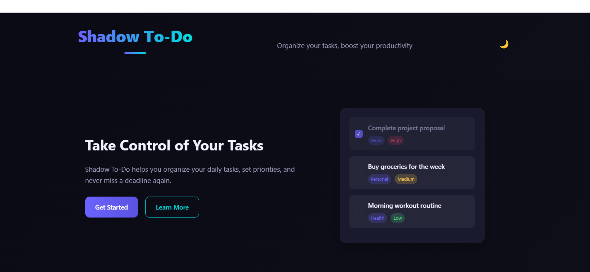
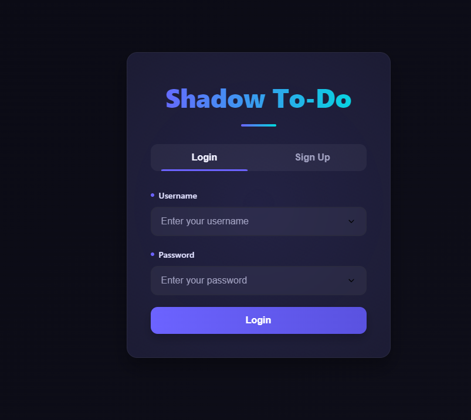
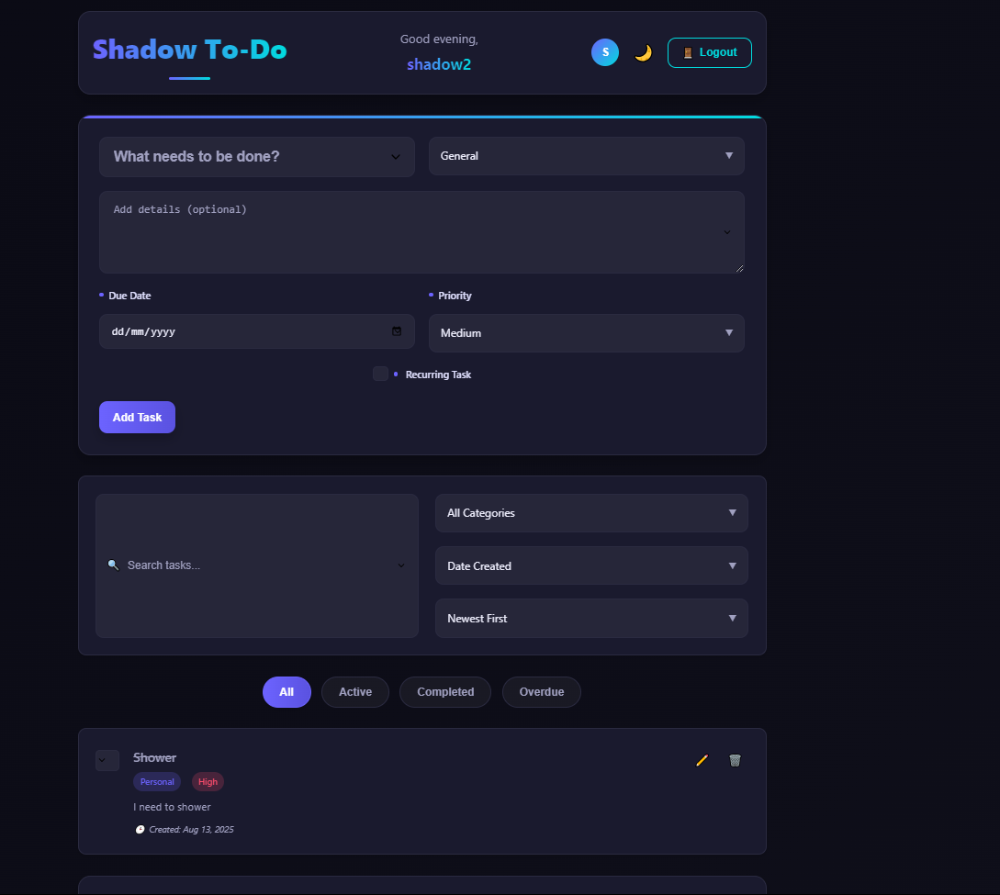

# Shadow To-Do List

A modern, feature-rich task management application with a sleek dark/light theme interface.

## Features

- 🔐 User authentication (signup/login)
- 📋 Task management with categories and priorities
- 🗓️ Due dates and recurring tasks
- 🔍 Search and filter capabilities
- 📊 Task statistics and progress tracking
- 🌙 Dark/Light theme toggle
- 📱 Fully responsive design
- 🔒 Secure data encryption

## Screenshots

### Landing Page


### Login Page


### Dashboard


## Installation

1. Clone the repository:
   ```bash
   git clone <repository-url>
   ```

2. Install dependencies:
   ```bash
   npm install
   ```

3. Start the server:
   ```bash
   npm start
   ```

4. Open your browser and navigate to `http://localhost:3000`

## Technologies Used

- **Frontend**: HTML5, CSS3, JavaScript (ES6+)
- **Backend**: Node.js, Express.js
- **Database**: JSON file storage
- **Authentication**: Session-based with bcrypt password hashing
- **Encryption**: AES-256-CBC for sensitive data

## Key Features

### User Authentication
- Secure signup and login with password encryption
- Session management for persistent login

### Task Management
- Create, read, update, and delete tasks
- Categorize tasks (Work, Personal, Shopping, Health, etc.)
- Set priority levels (High, Medium, Low)
- Add due dates and descriptions
- Mark tasks as completed

### Advanced Features
- **Recurring Tasks**: Set daily, weekly, or monthly recurring tasks
- **Search & Filter**: Find tasks by title, category, or status
- **Statistics**: Visual progress tracking with completion percentage
- **Responsive Design**: Works on desktop, tablet, and mobile devices
- **Theme Switching**: Toggle between dark and light modes

### Security
- Passwords hashed with bcrypt
- Email encryption for user privacy
- Session-based authentication

## Project Structure

```
shadow-crasher-recreation/
├── assets/
│   ├── dashboard_preview.png
│   ├── landingpagepreview.png
│   └── login_preview.png
├── data/
│   ├── todos.json
│   └── users.json
├── public/
│   ├── index.html
│   ├── landing.html
│   ├── script.js
│   └── styles.css
├── routes/
│   ├── auth.js
│   └── todos.js
├── .gitignore
├── README.md
├── package.json
└── server.js
```

## API Endpoints

### Authentication
- `POST /auth/signup` - Create a new user
- `POST /auth/login` - Login user
- `POST /auth/logout` - Logout user
- `GET /auth/me` - Get current user info

### Tasks
- `GET /todos` - Get all tasks for current user
- `POST /todos` - Create a new task
- `PUT /todos/:id` - Update a task
- `DELETE /todos/:id` - Delete a task
- `GET /todos/stats` - Get task statistics
- `GET /todos/categories` - Get unique categories

### User Preferences
- `GET /user/preferences` - Get user preferences
- `POST /user/preferences` - Update user preferences

## Contributing

1. Fork the repository
2. Create a new branch (`git checkout -b feature/AmazingFeature`)
3. Commit your changes (`git commit -m 'Add some AmazingFeature'`)
4. Push to the branch (`git push origin feature/AmazingFeature`)
5. Open a pull request

## License

This project is licensed under the MIT License - see the [LICENSE](LICENSE) file for details.

## Acknowledgments

- Modern UI design inspired by contemporary task management applications
- Icons from various open-source libraries
- Gradient color schemes for visual appeal